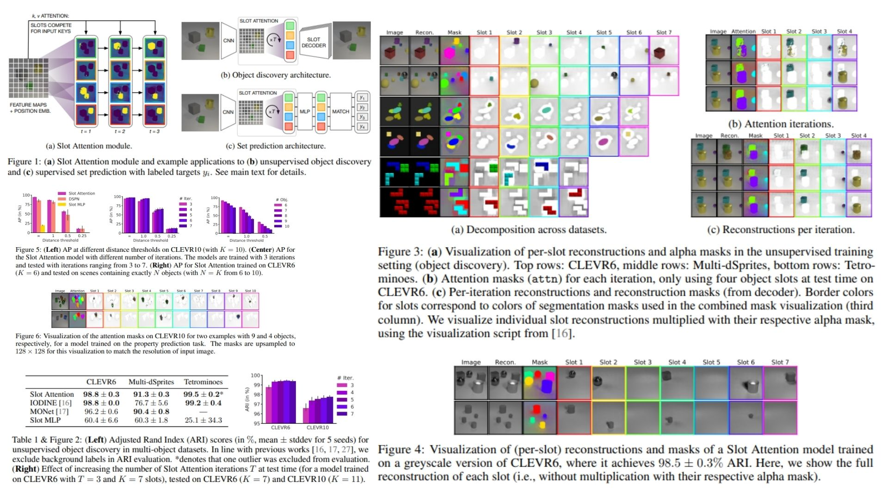

# 🎨 SlotAttention-Replication – Object-centric Representation Learning

This repository provides a **PyTorch-based replication** of  
**Slot Attention: Object-centric Learning with Iterative Attention**.

The focus is **understanding and implementing slot-based representations** practically,  
rather than chasing benchmark SOTA results.

- Captures **individual object features** from scenes 🪄  
- Uses **iterative attention for soft assignment to slots** 🔄  
- Modular & lightweight, **plug-and-play for any CNN backbone** ⚡  

**Paper reference:** [Object-centric Representation Learning](https://arxiv.org/abs/2006.15055) 📄

---

## 🌌 Overview – Slot Attention Pipeline



The core idea:

> Decompose a scene into a fixed number of **slots**, where each slot represents an object or part of the scene. The model iteratively updates slots to refine object-centric representations.

High-level procedure:

1. Extract **feature maps** $X \in \mathbb{R}^{C \times H \times W}$ from a CNN backbone.  
2. Add **2D positional encoding** $P \in \mathbb{R}^{H W \times D}$ to features:  
   $$X' = X + P$$
3. Initialize **K slot embeddings** $S \in \mathbb{R}^{K \times D_\text{slot}}$ with Gaussian noise:  
   $$S \sim \mathcal{N}(\mu, \sigma^2)$$
4. Iteratively refine slots (T iterations) using attention:  
```math
\text{Attention: } \alpha_{nk} = \frac{\exp(q_k \cdot k_n)}{\sum_j \exp(q_j \cdot k_n)}, \quad  
\text{Update: } S_k \gets \text{GRU}(S_k, \sum_n \alpha_{nk} v_n) + \text{MLP}(S_k)

X_k = \text{DecoderCNN}(S_\text{grid})
```

5. Broadcast refined slots to **2D spatial grids**:  
```math
S_\text{grid} \in \mathbb{R}^{K \times D_\text{slot} \times H \times W}
```
6. Decode slots into **RGB + alpha mask** per slot:
```math
\quad  
\text{Update: } S_k \gets \text{GRU}(S_k, \sum_n \alpha_{nk} v_n) + \text{MLP}(S_k)

X_k = \text{DecoderCNN}(S_\text{grid})
```
7. Compose final image via **soft-masked summation**:  
```math
\hat{X} = \sum_k \text{Softmax}(\text{mask}_k) \cdot \text{RGB}_k
```


The module is fully **end-to-end trainable** and generalizes to scenes with varying object counts.

---

## 🧮 Math Essentials – Slot Attention

### Slot Initialization
For $K$ slots with dimension $D_\text{slot}$:

$$
S_k \sim \mathcal{N}(\mu, \sigma^2), \quad k = 1 \dots K
$$

### Iterative Attention Update
Compute queries $Q$, keys $K$, values $V$:

$$
\begin{aligned}
Q &= \text{Linear}(S), \quad K, V = \text{Linear}(X') \\
\alpha_{nk} &= \frac{\exp(Q_k \cdot K_n / \sqrt{D_\text{slot}})}{\sum_j \exp(Q_j \cdot K_n / \sqrt{D_\text{slot}})} \\
\text{updates}_k &= \sum_n \alpha_{nk} V_n \\
S_k &\gets \text{GRU}(S_k, \text{updates}_k) + \text{MLP}(\text{LayerNorm}(S_k))
\end{aligned}
$$

### Compositor – Image Reconstruction
Given decoded RGB and masks:

$$
\hat{X} = \sum_k \text{Softmax}(\text{mask}_k) \cdot \text{RGB}_k
$$

Each slot contributes **to its masked region**, enabling object-centric reconstruction.

---

## 🧠 What the Module Does

- Decomposes scenes into **K slots**, one per object 🌟  
- Iteratively refines slot representations via **attention & GRU** 🔁  
- Decodes slots into **RGB + alpha masks** and reconstructs the full image 🖼️  
- Fully modular: can combine with **any CNN encoder/decoder backbone** ⚙️  

---

## 📦 Repository Structure

```bash
SlotAttention-Replication/
├── src/
│   ├── encoder/
│   │   ├── cnn_encoder.py        # Image → feature map (CNN backbone)
│   │   └── positional_embed.py  # 2D positional encoding (pixel coords)
│   │
│   ├── attention/
│   │   ├── qkv_projection.py    # Linear(Q), Linear(K), Linear(V)
│   │   ├── slot_attention.py    # Iterative attention + soft assignment
│   │   ├── slot_update.py       # GRU update + MLP refinement
│   │   └── slot_block.py        # Full Slot Attention block
│   │
│   ├── decoder/
│   │   ├── spatial_broadcast.py # Slot → spatial grid broadcast
│   │   ├── decoder_cnn.py       # CNN decoder (RGB + mask)
│   │   └── compositor.py        # Alpha masks + image composition
│   │
│   ├── model/
│   │   └── slot_autoencoder.py  # Encoder + SlotAtt + Decoder forward
│   │
│   └── config.py                # slot number, iterations, dimensions
│
├── images/
│   └── figmix.jpg                # Slot Attention overview
│
├── requirements.txt
└── README.md
```
---


## 🔗 Feedback

For questions or feedback, contact: [barkin.adiguzel@gmail.com](mailto:barkin.adiguzel@gmail.com)
